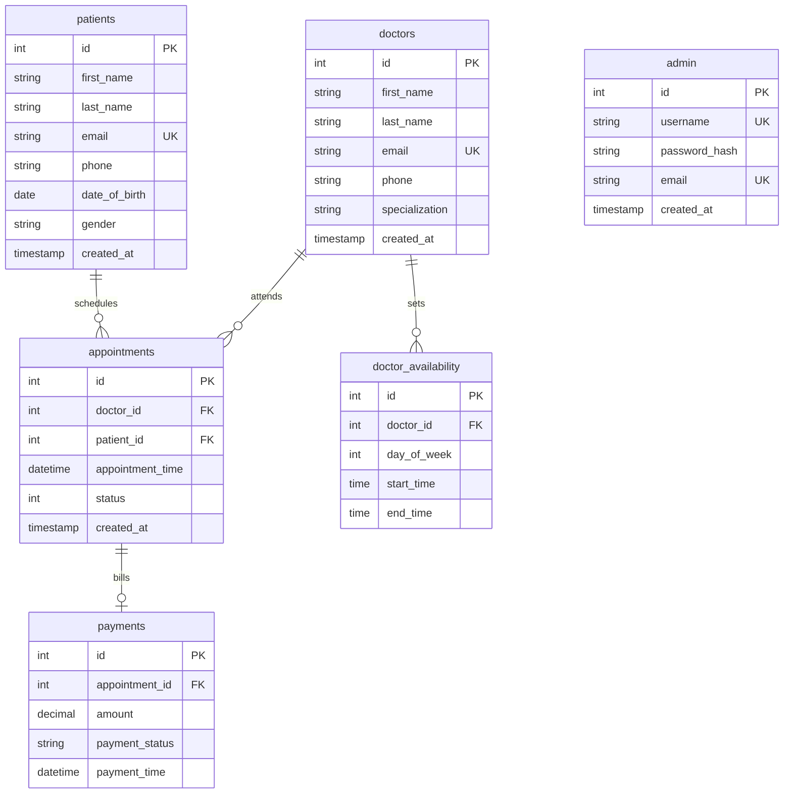

# Clinic Management System Schema Design

This document details the database schema design for the Clinic Management System, utilizing a polyglot persistence approach. Structured, transactional operational data is stored in MySQL, while flexible, document-based data is stored in MongoDB.

---

## MySQL Database Design

The relational database (MySQL) is responsible for core transaction safety, referential integrity, and structured relationships among patients, doctors, appointments, system administrators, scheduling, and billing.

### Entity-Relationship Diagram (ERD)



---

### Tables Schema Specifications

#### 1. Table: `patients`
Stores demographic and registration details for patients.

| Column Name | Data Type | Constraints | Description |
| :--- | :--- | :--- | :--- |
| `id` | `INT` | `PRIMARY KEY`, `AUTO_INCREMENT` | Unique identifier for each patient. |
| `first_name` | `VARCHAR(50)` | `NOT NULL` | Patient's first name. |
| `last_name` | `VARCHAR(50)` | `NOT NULL` | Patient's last name. |
| `email` | `VARCHAR(100)` | `UNIQUE`, `NOT NULL` | Used for login, communications, and lookup. |
| `phone` | `VARCHAR(20)` | `NOT NULL` | Primary contact number. |
| `date_of_birth` | `DATE` | `NOT NULL` | Patient's date of birth (used for age calculation). |
| `gender` | `VARCHAR(15)` | `NOT NULL` | Gender representation (e.g., Male, Female, Other). |
| `created_at` | `TIMESTAMP` | `DEFAULT CURRENT_TIMESTAMP` | Record creation timestamp. |

*Justification / Notes:*
* Email and phone format validations are enforced at the application level via regex patterns before saving to the database.

#### 2. Table: `doctors`
Stores doctor profiles, credentials, and contact details.

| Column Name | Data Type | Constraints | Description |
| :--- | :--- | :--- | :--- |
| `id` | `INT` | `PRIMARY KEY`, `AUTO_INCREMENT` | Unique identifier for each doctor. |
| `first_name` | `VARCHAR(50)` | `NOT NULL` | Doctor's first name. |
| `last_name` | `VARCHAR(50)` | `NOT NULL` | Doctor's last name. |
| `email` | `VARCHAR(100)` | `UNIQUE`, `NOT NULL` | Doctor's professional email. |
| `phone` | `VARCHAR(20)` | `NOT NULL` | Direct contact number. |
| `specialization` | `VARCHAR(100)` | `NOT NULL` | Medical department (e.g., Cardiology, Pediatrics). |
| `created_at` | `TIMESTAMP` | `DEFAULT CURRENT_TIMESTAMP` | Record creation timestamp. |

#### 3. Table: `appointments`
Tracks the scheduling, state, and assignments of patient-doctor visits.

| Column Name | Data Type | Constraints | Description |
| :--- | :--- | :--- | :--- |
| `id` | `INT` | `PRIMARY KEY`, `AUTO_INCREMENT` | Unique appointment ID. |
| `doctor_id` | `INT` | `FOREIGN KEY REFERENCES doctors(id) ON DELETE RESTRICT` | Doctor assigned. |
| `patient_id` | `INT` | `FOREIGN KEY REFERENCES patients(id) ON DELETE RESTRICT` | Patient scheduled. |
| `appointment_time` | `DATETIME` | `NOT NULL` | Date and time of the slot. |
| `status` | `INT` | `NOT NULL` | `0` = Scheduled, `1` = Completed, `2` = Cancelled. |
| `created_at` | `TIMESTAMP` | `DEFAULT CURRENT_TIMESTAMP` | Booking timestamp. |

*Justification / Notes:*
* Foreign key relationships use `ON DELETE RESTRICT` rather than `CASCADE` to preserve medical auditing history (see deep questions below).

#### 4. Table: `admin`
Stores system administrators who manage clinical configurations, doctors, and users.

| Column Name | Data Type | Constraints | Description |
| :--- | :--- | :--- | :--- |
| `id` | `INT` | `PRIMARY KEY`, `AUTO_INCREMENT` | Unique admin identifier. |
| `username` | `VARCHAR(50)` | `UNIQUE`, `NOT NULL` | Administrative login username. |
| `password_hash` | `VARCHAR(255)` | `NOT NULL` | Securely hashed password credential. |
| `email` | `VARCHAR(100)` | `UNIQUE`, `NOT NULL` | Administrative notification email. |
| `created_at` | `TIMESTAMP` | `DEFAULT CURRENT_TIMESTAMP` | Account creation timestamp. |

#### 5. Table: `doctor_availability`
Defines the repeating weekly working hours and schedule slots for each doctor.

| Column Name | Data Type | Constraints | Description |
| :--- | :--- | :--- | :--- |
| `id` | `INT` | `PRIMARY KEY`, `AUTO_INCREMENT` | Availability slot ID. |
| `doctor_id` | `INT` | `FOREIGN KEY REFERENCES doctors(id) ON DELETE CASCADE` | Associated doctor. |
| `day_of_week` | `INT` | `NOT NULL` | `1` = Monday, ..., `7` = Sunday. |
| `start_time` | `TIME` | `NOT NULL` | Shift start time (e.g., `09:00:00`). |
| `end_time` | `TIME` | `NOT NULL` | Shift end time (e.g., `17:00:00`). |

#### 6. Table: `payments`
Maintains billing transactions linked to patient appointments.

| Column Name | Data Type | Constraints | Description |
| :--- | :--- | :--- | :--- |
| `id` | `INT` | `PRIMARY KEY`, `AUTO_INCREMENT` | Unique payment record ID. |
| `appointment_id` | `INT` | `FOREIGN KEY REFERENCES appointments(id) ON DELETE RESTRICT` | Associated appointment. |
| `amount` | `DECIMAL(10,2)` | `NOT NULL` | Transaction total amount. |
| `payment_status` | `VARCHAR(20)` | `NOT NULL` | e.g., `PENDING`, `COMPLETED`, `REFUNDED`. |
| `payment_time` | `DATETIME` | | Time when transaction occurred. |

---

### Architectural Reflections & Justifications

#### Q: What happens if a patient is deleted? Should appointments also be deleted?
> [!IMPORTANT]
> **No, appointments must NOT be deleted.** 
> For clinical audit trails, compliance regulations (such as HIPAA), and malpractice insurance requirements, clinic history must never be hard-deleted.
> * **Implementation Choice:** We enforce `ON DELETE RESTRICT` on `patient_id` in the `appointments` table. 
> * **Alternative Strategy:** To remove a patient from active lists while preserving records, a soft delete design is preferred:
>   - Add an `is_active` boolean flag to the `patients` table.
>   - When a patient requests account removal, the system marks `is_active = FALSE` and anonymizes sensitive columns (PII scrub: replacing name with `"Anonymized Patient"` and clearing email/phone).

#### Q: Should a doctor be allowed to have overlapping appointments?
> [!WARNING]
> **No, overlapping appointments are prohibited.**
> * **Implementation Choice:** This cannot easily be represented with database-level static unique constraints alone because appointments occupy time spans. Instead, we enforce this concurrently at the **application/service layer** within a transaction:
>   - Check if an appointment exists for `doctor_id` within the desired interval before executing the insert.
>   - Apply a database index on `(doctor_id, appointment_time)` to quickly query conflicts.
>   - Use database-level optimistic locking or pessimistic write locking (`SELECT ... FOR UPDATE`) during slot booking to handle race conditions where two clients attempt to book the same slot at the same microsecond.

#### Q: Should each doctor have their own available time slots?
> [!NOTE]
> **Yes.** Doctors have different shift schedules, clinics, and specialties. 
> * **Implementation Choice:** The `doctor_availability` table acts as a template for recurring shifts. When a patient books an appointment, the service layer validates that the selected datetime falls within the doctor's active availability slots and is not already booked.

#### Q: Should a patient's past appointment history be retained forever?
> [!TIP]
> **Yes, on-disk storage is cheap, but medical information is invaluable.**
> * **Implementation Choice:** In our relational design, appointment data is retained permanently. However, to keep transaction tables lightweight, older historical records (e.g., older than 5 years) can be periodically archived into a cold-storage read-only database, keeping the operational MySQL database highly performant.

#### Q: Is a prescription tied to a specific appointment or can it exist independently?
> [!NOTE]
> **It is hybrid.**
> While most prescriptions are written *during* a consultation (and thus refer to an `appointment_id`), a refill or updated prescription might be issued outside of a formal appointment.
> * **Implementation Choice:** In the NoSQL prescription model, `appointmentId` is optional (`nullable`). This allows prescriptions to exist independently while still linking back to the relevant appointment when applicable.

---

## MongoDB Collection Design

MongoDB handles unstructured, flexible, and rapidly evolving data objects such as clinical notes, prescription sheets containing various compound lists, chat communications, and system audit logs.

### Collection 1: `prescriptions`
This collection accommodates flexible medication structures, refill rules, and doctor notes.

```json
{
  "_id": "64abc1234567890abcdef123",
  "patientId": 104,
  "patientName": "John Smith",
  "doctorId": 12,
  "doctorName": "Dr. Sarah Connor",
  "appointmentId": 51,
  "issuedDate": "2026-05-31T11:45:00Z",
  "medications": [
    {
      "name": "Paracetamol",
      "dosage": "500mg",
      "frequency": "Three times daily after meals",
      "durationDays": 7,
      "refillsRemaining": 2
    },
    {
      "name": "Amoxicillin",
      "dosage": "250mg",
      "frequency": "Every 8 hours",
      "durationDays": 5,
      "refillsRemaining": 0
    }
  ],
  "doctorClinicalNotes": "Patient presents with persistent mild fever and throat inflammation. Monitor temperature daily. Return if symptoms worsen.",
  "status": "ACTIVE",
  "pharmacy": {
    "name": "Walgreens SF",
    "location": "123 Market Street, San Francisco, CA",
    "phone": "+1-415-555-0199"
  },
  "metadata": {
    "sourceSystem": "Web_Portal_V2",
    "digitallySignedBy": "Dr. Sarah Connor (License #MD99318)"
  }
}
```

---

### Collection 2: `patient_feedback`
Stores optional reviews, patient-reported outcome measures, and ratings of clinical visits.

```json
{
  "_id": "64abc4567890abcdef123456",
  "appointmentId": 51,
  "patientId": 104,
  "rating": 5,
  "feedbackCategory": [
    "Punctuality",
    "Bedside Manner",
    "Clarity of Explanation"
  ],
  "comments": "Dr. Connor was exceptionally thorough and explained the prescription guidelines very clearly. Highly recommend!",
  "submittedAt": "2026-05-31T14:30:00Z",
  "anonymous": false
}
```

---

### Collection 3: `consultation_notes` (Clinical Notes)
Free-form medical consultation SOAP (Subjective, Objective, Assessment, Plan) records.

```json
{
  "_id": "64abc7890abcdef123456789",
  "appointmentId": 51,
  "patientId": 104,
  "doctorId": 12,
  "soapNotes": {
    "subjective": "Patient reports feeling fatigued for 3 days with a mild sore throat. No chest pain or difficulty breathing.",
    "objective": "Temp: 100.2 F. Throat shows moderate erythema, no exudate. Lungs clear to auscultation.",
    "assessment": "Acute pharyngitis, likely viral.",
    "plan": "Rest, hydration, and symptomatic relief with paracetamol. Follow-up in 3 days if fever persists."
  },
  "attachments": [
    {
      "fileUrl": "https://storage.clinic.org/records/104/throat_scan_20260531.png",
      "fileType": "image/png",
      "description": "Visual scan of pharynx"
    }
  ],
  "lastModified": "2026-05-31T11:50:00Z"
}
```

---

### Architectural Reflections & Justifications

#### Q: Should MongoDB documents include the full patient object or just an ID?
> [!IMPORTANT]
> **We should store the Patient ID (`patientId`) as the single reference link, but we can denormalize search-critical read-only fields.**
> * **Primary Reference:** Storing `patientId: 104` maps to the MySQL primary key. This is the canonical link that maintains a single source of truth for patient identity.
> * **Denormalization (Cached Read Data):** Including fields like `patientName` in the NoSQL document is a good trade-off in MongoDB. It avoids expensive application-level cross-database joins when rendering prescription lists or medical logs. Since a patient's name changes very rarely, the risk of data drift (out-of-sync data) is minimal.

#### Q: What would a chat message document look like?
Here is the design for a chat message document. It accommodates text, media attachments, read receipts, and system events inside chat channels.

```json
{
  "_id": "64abc999888777abcdef111",
  "channelId": "chat_pat104_doc12",
  "sender": {
    "role": "PATIENT",
    "id": 104
  },
  "recipient": {
    "role": "DOCTOR",
    "id": 12
  },
  "messageType": "TEXT", 
  "content": "Hello Doctor, I started taking the Paracetamol but I still have a mild headache. Is that normal?",
  "attachments": [],
  "sentAt": "2026-05-31T15:00:00Z",
  "deliveredAt": "2026-05-31T15:00:05Z",
  "readReceipts": [
    {
      "userId": 12,
      "userRole": "DOCTOR",
      "readAt": "2026-05-31T15:10:00Z"
    }
  ]
}
```

#### Q: What happens if the schema needs to evolve – will your design support that?
> [!TIP]
> **Yes, MongoDB's flexible schema handles evolution gracefully.**
> * Since NoSQL databases do not require rigid table-wide structure alterations, we can add fields (like `dosageInstructions`, `contraindications`, or `refillsRemaining`) directly to new documents without migrating old records.
> * The Spring Boot Application handles this schema drift through standard Java object modeling:
>   - Older records parsed by the model simply map missing properties to `null` or default values.
>   - When writing back or updating, the schema naturally expands to the latest definition.
